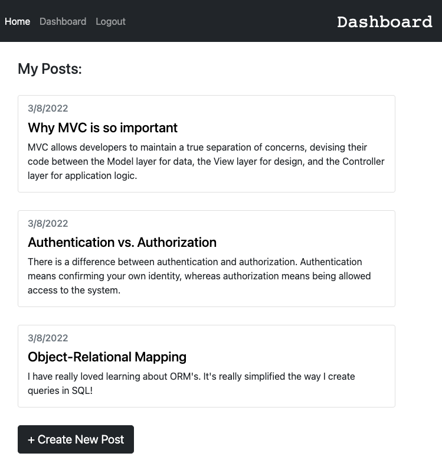

# tech-blog

This simple tech blog gives users the capability to share there thoughts and discoveries about everything tech-related. They can create a blog post about any topic, as well as comment on other users' posts.

By logging in and clicking "dashboard" in the nav bar, the user will see the option to create a post. Once they make a post, they will have the option to edit or delete their post at any time by just clicking the title of the post in the dashboard.

Link To Deployed Heroku Application

https://mk-tech-blog.herokuapp.com/
